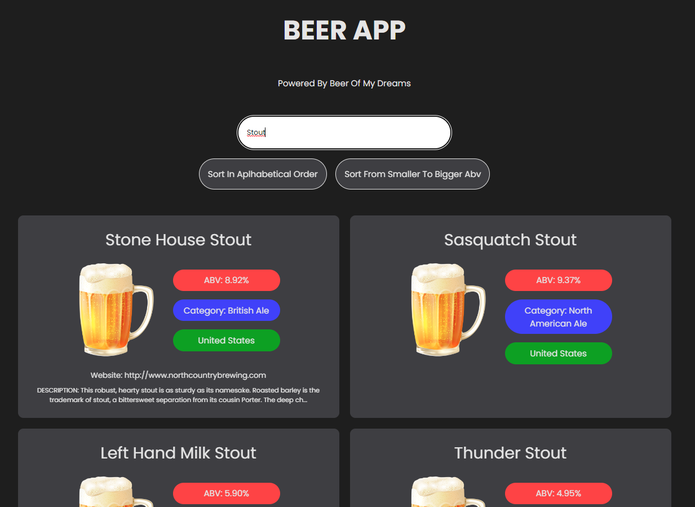

<h1>beer-app-repenso-challenge</h1>

Este repositório é destinado a um desafio de código proposto pela empresa Repenso. A aplicação foi desenvolvida usando ReactJs, Styled Components, TypeScript e tecnologias relaciondas.

<h1>IMPORTANTE!!!</h1>

- O projeto do Backend não veio com o CORS configurado, estáva dando bloqueio de CORS ao tentar consumir no frontend;
- Adicionei a configuração de CORS no backend e mudei a porta de execução do projeto para http://localhost:8080;
- Link do novo repositório do backend para consumo: https://github.com/mariojuniordev/repenso-beer-backend-atualizado;
- Obs.: o frontend já está configurado para consumir a API na porta 8080;

<h2>Solução Adotada para o Projeto</h2>

- O projeto foi desenvolvido utlizando ReactJS e NextJS com template de TypeScript;
- Por questões de agilidade e maior afinidade com a tecnologia foi utilizado Styled Components para desenvolvimento da User Interface;
- Para consumo da API foi utilizado a lib Axios;

<h2>Como Instalar as Dependências do Projeto</h2>

yarn

<h2>Como Executar o Projeto em Desenvolvimento</h2>

yarn dev

<h2>IMPORTANTE LEMBRAR DE EXECUTAR O BACKEND DISPONIBILIZADO NO LINK ACIMA PARA CORRETO FUNCIONAMENTO DA APLICAÇÃO!</h2>

<h3>Requisitos Propostos pela Empresa</h3>

- Mostrar os dados de forma organizada;
- Adicionar filtro para os dados;
- Adicionar mecânica de ordenação dos dados;  

